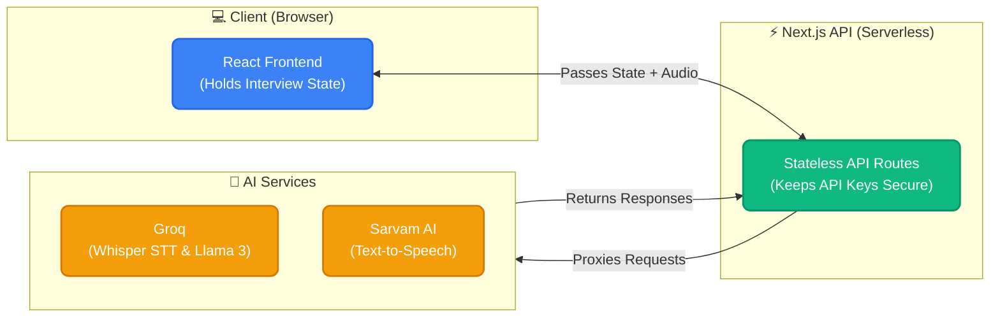

# AI Tutor Screener - Architecture

```mermaid
flowchart LR
    %% Define styles for a modern look
    classDef frontend fill:#3b82f6,stroke:#2563eb,stroke-width:2px,color:#fff,rx:8px,ry:8px
    classDef backend fill:#10b981,stroke:#059669,stroke-width:2px,color:#fff,rx:8px,ry:8px
    classDef ai text-align:center,fill:#f59e0b,stroke:#d97706,stroke-width:2px,color:#fff,rx:8px,ry:8px

    subgraph User["💻 Client (Browser)"]
        UI["React Frontend<br/>(Holds Interview State)"]:::frontend
    end

    subgraph Server["⚡ Next.js API (Serverless)"]
        API["Stateless API Routes<br/>(Keeps API Keys Secure)"]:::backend
    end

    subgraph Inference["🧠 AI Services"]
        Groq["Groq<br/>(Whisper STT & Llama 3)"]:::ai
        Sarvam["Sarvam AI<br/>(Text-to-Speech)"]:::ai
    end

    %% Flow of data
    UI <-->|Passes State + Audio| API
    API -->|Proxies Requests| Inference
    Inference -->|Returns Responses| API
```
